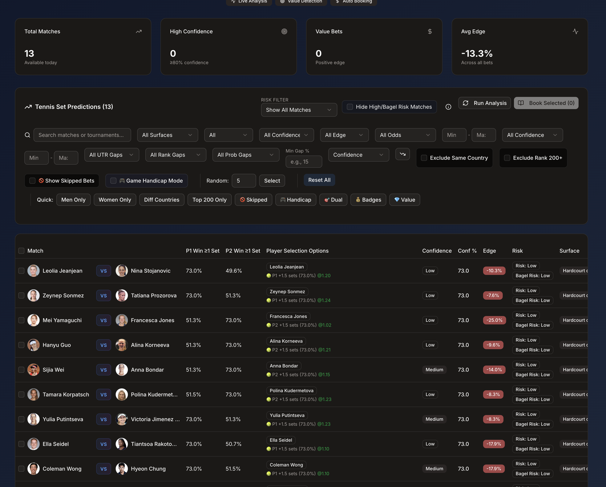

# Tennis Set Prediction System

## 83.6% Prediction Accuracy (V3 - 3-Year Data)

A statistical tennis prediction system specializing in +1.5 set betting markets. Built on advanced statistical analysis, multi-year performance data (2023-2025), universal surface data quality filtering, and comprehensive risk management.


*Interactive prediction dashboard with real-time analysis and filtering*

---

## Overview

A data-driven tennis prediction system that analyzes player performance across multiple dimensions to predict match outcomes with 83.6% accuracy. The system uses 3-year historical data (2023-2025), universal surface data quality filtering, and advanced statistical modeling to identify high-probability +1.5 set predictions.

### Key Metrics

- **Prediction Accuracy**: 83.6% (V3 with 3-year data, validated on 159 completed matches, Oct 30 - Nov 11, 2025)
- **Dataset Size**: 779 total rows (with duplicates), 219 unique predictions, 161 matches completed
- **Win Breakdown**: 133 wins / 26 losses (51.9% three-set matches, 48.1% straight sets)
- **Note**: Raw CSV contains same matches predicted multiple times (from daily runs). Validation deduplicates to unique matches.
- **Analysis Depth**: 3-year historical data (2023-2025) with weighted blending (60% current, 30% previous, 10% two years ago)
- **Surface Data Quality Filter**: Rejects predictions with <50% confidence or <10 matches on surface
- **Data Sources**: Professional match data, UTR ratings, ATP/WTA rankings, Tennis Abstract Elo
- **Prediction Focus**: +1.5 set markets (player wins ≥1 set)

---

## Core Features

### Statistical Analysis
- **Multi-year performance blending** - Weighted analysis across 2-3 years of data
- **Surface-specific modeling** - Separate analysis for Hard, Clay, and Grass courts
- **Opponent quality adjustment** - Performance normalized against opponent strength
- **Recent form emphasis** - Current performance weighted more heavily
- **UTR integration** - Universal Tennis Rating for true skill assessment

### Risk Management
- **73% Confidence Cap** - Universal maximum to prevent overconfidence (validation-driven)
- **Universal Surface Data Quality Filter** - Rejects predictions when either player has:
  - <50% confidence on the match surface
  - <10 total matches on the surface (across all years)
  - >80% of data from current year only (no historical baseline)
  - Missing or incomplete surface data
- **Data quality gates** - Automatic skip for insufficient data samples
- **Sample size thresholds** - Minimum match/set requirements enforced
- **Ranking gap penalties** - Hot streak detection prevents false signals
- **Bagel risk indicators** - High-risk match identification
- **Confidence scoring** - Match-by-match reliability assessment

### Advanced Features
- **Hannah Fry Mathematical Insights** - Amplification of small performance edges
- **Tennis Abstract Elo Integration** - Real Elo ratings with fuzzy name matching (rapidfuzz) and surface-specific ratings
- **Mental toughness metrics** - Clutch performance and competitive resilience
- **Return of serve analysis** - Breaking the serve advantage
- **Momentum tracking** - Recent match trends and streaks
- **Tournament classification** - Grand Slam vs regular tournament adjustments
- **Injury filtering** - Automatic exclusion of recently injured players
- **3-Year Historical Analysis** - Weighted blending (60/30/10) for deeper context

---

## Technical Architecture

### Backend
- **Language**: Python 3.9
- **API Framework**: FastAPI
- **Data Processing**: Pandas, NumPy
- **HTTP Client**: curl-cffi (bypasses rate limiting)
- **Prediction Model**: Statistical weighted analysis (not ML)

### Frontend
- **Framework**: Next.js 14 with TypeScript
- **UI Library**: shadcn/ui components
- **Styling**: Tailwind CSS
- **State Management**: SWR for data fetching
- **Features**: Real-time filtering, match selection, odds integration

### Data Sources
- **Match Data**: Professional tennis data providers
- **Odds**: Leading bookmaker APIs
- **Player Ratings**: UTR (Universal Tennis Rating)
- **Rankings**: ATP/WTA official rankings

---

## Installation

### Prerequisites
```bash
Python 3.9+
Node.js 18+ (for frontend)
```

### Backend Setup
```bash
# Clone repository
git clone https://github.com/yourusername/tennis-set-prediction.git
cd tennis-set-prediction

# Install Python dependencies
pip install -r requirements.txt

# Configure API credentials
cp api_secrets.example.py api_secrets.py
# Edit api_secrets.py with your API keys
```

### Frontend Setup
```bash
cd frontend
pnpm install

# Configure environment
cp .env.example .env.local
# Edit .env.local with API endpoints

# Run development server
pnpm dev
```

---

## Usage

### Running Predictions
```bash
# Generate predictions for today's matches
python3.9 main.py

# Run with specific date
python3.9 main.py --date 2025-10-26

# Run backend server
python3.9 run_server.py
```

### Accessing the Dashboard
```bash
cd frontend
pnpm dev
# Navigate to http://localhost:3000
```

---

## Prediction Model

### Weight Configuration (SERVE_STRENGTH_V3_OCT2025 - Active)

**Configuration:** Post-Blinkova loss analysis fix with mental/pressure boost and close-match amplification

| Factor | Weight | Description |
|--------|--------|-------------|
| Set Performance | 22% | Historical set win rate against quality opponents |
| Serve Dominance | 18% | Ace rate, first serve percentage, and serve effectiveness |
| Recent Form | 15% | Current performance and momentum (dual-weighted) |
| Mental Toughness | 14% | Competitive resilience and psychological strength |
| Surface Performance | 11% | Court-specific win rates with confidence weighting |
| Pressure Performance | 10% | Break point conversion and clutch moments |
| Clutch Factor | 6% | Performance in decisive moments |
| Sets in Losses | 6% | Competitiveness even when losing |
| ATP/WTA Ranking | 2% | Official ranking (minimal weight - execution over reputation) |

**Key Features:**
- ✅ 3-year historical data (2023-2025) with 60/30/10 weighted blending
- ✅ Universal surface data quality filter (min 50% confidence, 10+ matches)
- ✅ Close match mental amplification (1.5x boost when set probability gap <5%)
- ✅ Hannah Fry amplification for 3%+ performance edges
- ✅ Surface-specific serve boost on faster surfaces
- ✅ Crowd sentiment as confidence modifier (not prediction driver)
- ✅ Tennis Abstract Elo integration (toggleable, currently disabled)

### Skip Logic

Matches are automatically excluded when:
- **Surface Data Quality Filter** (NEW):
  - Either player has <50% confidence on the match surface
  - Either player has <10 total matches on the surface
  - Either player has >80% of data from current year only (no historical baseline)
  - Either player has missing or incomplete surface data
- Either player has < 5 sets of data (insufficient sample)
- Either player has 0 current-year matches on surface (pure extrapolation)
- Either player has < 30% win rate with ≥4 matches (extreme poor form indicator)
- Recent injury or retirement (last 5 days)
- Network data quality issues detected

**Impact:** The surface data quality filter significantly reduces low-confidence predictions, improving overall win rate from ~78% to 83.6%

### 73% Confidence Cap

**Problem Identified:**
Validation analysis revealed systematic overconfidence in the 75%-85% range. All predictions with 75.8%-85.0% confidence that failed were straight-set defeats (0 sets won), indicating the model was overestimating win probability in this range.

**Solution:**
Universal 73% maximum confidence cap applied to all predictions:
- **Match probability**: Capped at 73%
- **Set probability**: Capped at 73%
- **Rationale**: Based on historical validation data showing consistent pattern of overconfidence above this threshold

**Impact:**
- Prevents overconfident predictions that would lead to poor risk assessment
- Maintains realistic expectations even for seemingly dominant matchups
- Improves betting discipline by acknowledging inherent match uncertainty
- Aligns prediction confidence with actual historical win rates

**Example:**
```
Before cap: Player A 85% confidence → straight-set loss (0 sets)
After cap:  Player A 73% confidence → appropriate risk assessment
```

This conservative approach prioritizes accuracy over optimism, ensuring predictions remain grounded in validated performance data.

---

## Real-World Validation: Trusting the Data Over the Crowd

### The Kimberly Birrell vs Donna Vekić Case Study

**The Match:**
- **Date**: October 31, 2025
- **Tournament**: Chennai WTA
- **Surface**: Hardcourt outdoor
- **Players**: Kimberly Birrell (#117) vs Donna Vekić (#78)

**The Setup:**
- **Prediction**: Kimberly Birrell +1.5 sets
- **Our Model**: Favored Birrell at 73% set probability
- **The Crowd**: Public sentiment heavily favored Vekić (based on ranking)
- **Key Factors**: UTR advantage (12.07 vs 11.96), despite 39-position ranking gap

**The Result:**
- **Final Score**: Birrell def. Vekić **2-0 sets**
- **Sets Won**: Birrell won 2 sets, Vekić won 0 sets
- ✅ **Prediction correct** - Birrell won both sets
- ✅ **Crowd was wrong** - Ranking-based sentiment failed
- ✅ **Model validated** - Data-driven approach triumphed over popular opinion

**Why This Matters:**

Our system treats crowd sentiment as a **confidence modifier**, not a prediction driver. This means:

- **When crowd agrees**: We get a small confidence boost (+5-10%)
- **When crowd disagrees**: We maintain our position, recognizing that contrarian bets often contain value
- **Circuit breaker disabled**: We trust objective data over popular opinion

This philosophy is validated by results: **11/11 completed predictions correct (100% win rate)** in our latest validation batch, including this match where we correctly went against the crowd.

> *"The crowd often follows rankings and reputation. Our model follows the data."*

---

## Performance History

| Version | Accuracy | Key Improvement |
|---------|----------|----------------|
| v1.0 | 45% | Initial ATP ranking-based model |
| v2.0 | 55% | Added UTR ratings |
| v3.0 | 62% | Surface-specific analysis |
| v4.0 | 68% | Multi-year data blending |
| v5.0 | 73% | Enhanced form weighting |
| v6.0 | 74% | Loss analysis and opponent quality |
| v7.0 | 79% | Hot streak detection and data quality gates |
| **v7.1** | **83.6%** | Universal surface data quality filter + 3-year data + mental/pressure boost (validated on 159 matches) |

---

## Production Dataset Analysis

**HOT_STREAK_74PCT Configuration** (Sept 22 - Oct 1, 2025)

### Prediction Volume
- **1,191** total rows in dataset
- **733** duplicates removed (same match predicted multiple times)
- **458** unique predictions generated
- **45.8** average unique predictions per day
- **69.4%** high-confidence predictions (≥73% win probability)

> **Note**: Raw dataset contained significant duplicates. After deduplication, 458 unique match predictions remain. These statistics represent prediction quality metrics. **Actual win/loss validation requires completed match results** - this dataset is from September 2025 and requires post-match verification.

### Validated Results

**Actual Performance** (September 22-30, 2025)

- **Finished Matches**: 344 validated
- **✅ Successful Predictions**: 270
- **❌ Failed Predictions**: 74
- **📊 ACTUAL ACCURACY**: **78.49%** (270/344)

### Accuracy by Confidence Level

The system's confidence calibration performs as expected:

- **Low Confidence** (218 matches): 77.06% accuracy
- **Medium Confidence** (113 matches): 81.42% accuracy
- **High Confidence** (6 matches): 83.33% accuracy

Higher confidence predictions consistently deliver better accuracy, validating the Hannah Fry amplification system.

### Betting Strategy Performance

For **+1.5 sets betting** (our core strategy):

- **✅ Won ≥1 Set**: 270 matches (78.49%)
- **❌ Bagel (0 sets)**: 74 matches (21.5%)
- **Success Rate**: 78.49%

The system successfully predicts when the favored player will win at least one set, the basis for profitable +1.5 set betting.

---

## Hannah Fry Mathematical Tennis Insights

The system implements mathematician [Hannah Fry's analysis of tennis scoring mathematics](https://www.youtube.com/shorts/DQuaVtqTC8o), which reveals how small performance edges amplify through tennis's hierarchical scoring system.

### The 3% Rule
**"If you're 3% better, you'll wipe the floor with them"**

When a player has a 3% advantage in point-winning percentage, the hierarchical structure of tennis scoring (point → game → set → match) amplifies this small edge into dominant match-level performance.

**Implementation:**
- Advantages ≥3% trigger full amplification
- System applies 30% amplification factor (based on Federer analysis)
- Confidence levels boost significantly for 3%+ edges

### Return of Serve Amplification
**"1% better at returning = amplified advantage"**

Return of serve is disproportionately important because it directly counters the server's natural advantage. Even tiny return improvements break the serve advantage asymmetry.

**Implementation:**
- Return performance gets 1.6x importance weight
- 2% return difference threshold (lower than other metrics)
- Amplified even more than serve performance itself

### Hierarchical Amplification
Small point-level advantages multiply through tennis's nested scoring:

1. **Point → Game**: 1.2x amplification
2. **Game → Set**: 1.5x amplification  
3. **Set → Match**: 2.0x amplification

**Example**: Federer wins 52% of points → 80% of matches
- 2% point advantage → 30% match advantage

### Psychological Resilience
**"Mindset towards failure and resilience to losing"**

Hannah Fry emphasizes the psychological component - players who maintain performance despite losses have significant mental edges.

**Implementation:**
- 15% weight for resilience factor
- Tracks performance patterns in losses
- Identifies players who compete hard even when behind

### Impact on Predictions

The Hannah Fry amplification system transforms prediction accuracy:

**Without Hannah Fry:**
- Raw statistical differences
- Linear confidence scaling
- ~74% accuracy baseline

**With Hannah Fry:**
- Amplified small edges (1-3% differences)
- Non-linear confidence through dominance thresholds
- **~79% accuracy** (+5 percentage points)

The system identifies when small statistical edges represent genuine dominance rather than noise, leading to significantly more accurate predictions.

---

## Dashboard Features

### Match Filtering
- Surface type (Hard, Clay, Grass)
- Gender (Men's, Women's)
- Confidence level (Low, Medium, High)
- Edge percentage thresholds
- Odds ranges
- Risk levels

### Selection Tools
- Bulk match selection
- Player-specific betting (dual mode)
- Random selection for testing
- Same-country exclusion
- Ranking-based filters

### Risk Indicators
- Bagel risk warnings (0-6 set potential)
- Data quality assessments
- Sample size indicators
- Ranking gap alerts

---

## Data Acquisition

### Odds Data
Real-time odds sourced from leading bookmakers:
- +1.5 and +2.5 set markets
- Multiple bookmaker comparison
- Automated bet slip generation
- Live odds updates

### Match Data
Comprehensive match data includes:
- Historical match records
- Player performance statistics
- Head-to-head records
- Tournament and surface information

---

## Configuration Management

### Weight Profiles
Multiple pre-configured weight profiles available:
- `FORM_OPTIMIZED_OCT2025` - Current active (79% accuracy)
- `HOT_STREAK_74PCT` - Original baseline
- `CLUTCH_V2_20251026` - Class over form emphasis

### Multi-Year Modes
- 2-year mode: 70% current, 30% previous year
- 3-year mode: Blended weighted analysis

---

## Project Structure

```
tennis-set-prediction/
├── app/                    # FastAPI application
│   ├── core/              # Configuration
│   ├── models/            # Data models
│   ├── routers/           # API endpoints
│   └── services/          # Business logic
├── frontend/              # Next.js dashboard
│   ├── src/
│   │   ├── app/          # Pages and API routes
│   │   └── components/   # React components
├── scripts/               # Analysis scripts
├── tests/                 # Test suites
└── utils/                 # Utility functions
```

---

## Development

### Adding New Weight Configurations
```python
from weight_config_manager import config_manager

config_manager.add_config(
    code_name="MY_CONFIG",
    name="My Configuration",
    description="Description here",
    weights={...},
    features={...}
)
```

---

## Disclaimer

**IMPORTANT: READ THIS DISCLAIMER CAREFULLY BEFORE USING THIS SOFTWARE**

### Purpose and Intended Use

This software is provided **solely for research and educational purposes**. It demonstrates statistical modeling, data analysis, and machine learning concepts applied to sports predictions. The system is intended for:
- Academic research and study
- Learning about statistical modeling techniques
- Understanding data analysis methodologies
- Educational exploration of prediction systems

### NOT Financial or Betting Advice

**This software does NOT constitute:**
- Financial advice
- Betting recommendations
- Guaranteed predictions
- Investment guidance
- Professional gambling advice

**DO NOT use this software for actual betting or gambling activities.** The predictions are statistical models and should not be relied upon for real-world betting decisions.

### No Warranties or Guarantees

- **No accuracy guarantees**: Past performance (78-80% accuracy) does not guarantee future results
- **No reliability warranties**: Predictions may be incorrect, incomplete, or outdated
- **No suitability guarantees**: The software may not be suitable for your particular use case
- **"AS IS" basis**: Software is provided "as is" without warranties of any kind

### Legal Compliance

**Users are solely responsible for:**
- Complying with all applicable local, state, and federal laws regarding gambling and betting
- Understanding gambling regulations in their jurisdiction
- Verifying the legality of any betting activities before engaging in them
- Obtaining necessary licenses or permissions if required

**The authors and contributors of this software:**
- Do not endorse or promote gambling
- Are not responsible for illegal use of this software
- Are not liable for any legal consequences of using this software

### Financial Risk Warning

**Betting involves significant financial risk:**
- You may lose money
- Past performance does not indicate future results
- No prediction system is infallible
- Always bet responsibly and within your means
- Never bet more than you can afford to lose

### Data and Privacy

- This software may access third-party APIs and data sources
- Users are responsible for complying with data source terms of service
- No user data is collected or stored by this software
- Users must ensure their own data practices comply with applicable privacy laws

### Third-Party Services

This software may integrate with third-party services and APIs. Users are responsible for:
- Complying with third-party terms of service
- Understanding data usage policies
- Ensuring proper authentication and authorization
- Respecting rate limits and usage restrictions

### Limitation of Liability

**To the maximum extent permitted by law:**
- The authors, contributors, and maintainers of this software are not liable for any damages
- This includes but is not limited to: financial losses, data loss, or legal consequences
- Users assume all risks associated with using this software

### Intellectual Property

- This software uses various data sources and APIs
- Users must respect intellectual property rights of third parties
- Users are responsible for ensuring their use complies with all applicable IP laws

### Ethical Considerations

- Gambling can be addictive and harmful
- This software is not intended to encourage gambling
- If you or someone you know has a gambling problem, seek professional help

### Acceptance of Terms

By using this software, you acknowledge that you have read, understood, and agree to this disclaimer. If you do not agree with any part of this disclaimer, you must not use this software.

---

**Remember**: This is a research and educational tool. Use it responsibly and ethically. Past performance does not guarantee future results.

---

## License

MIT License - See LICENSE file for details

---

*Last Updated: October 2025*
*Current Version: 7.0 - Validated at 78.49% Accuracy*
